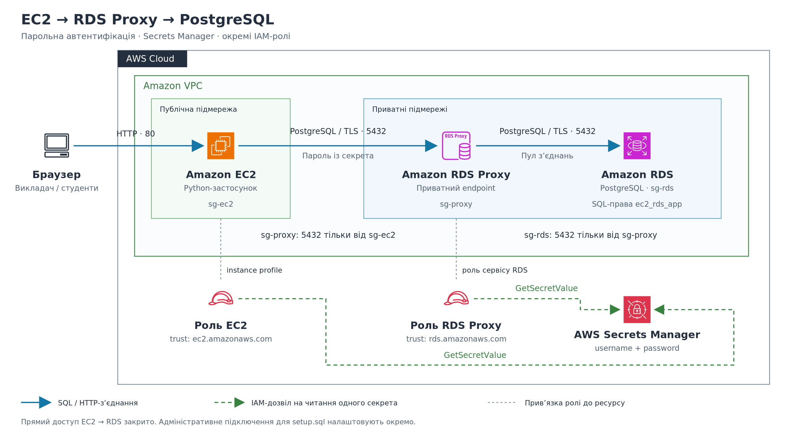

# EC2 → RDS Proxy → RDS PostgreSQL

[SVG для редагування](architecture.svg). Використано офіційні
[AWS Architecture Icons](https://aws.amazon.com/architecture/icons/),
набір від 31.07.2026. Діаграма спрощує фізичне розміщення ресурсу між AZ.

Застосунок і проксі читають той самий секрет, використовуючи різні IAM-ролі.
EC2 підключається до приватного endpoint RDS Proxy з паролем із Secrets Manager.
Проксі використовує пул з'єднань до RDS PostgreSQL і credentials цього секрета.
Роль EC2 не відкриває мережеві порти та не передається проксі.

## Підготовка бази

Виконати кроки 1–4 [README](README.md) для створення RDS, demo.messages,
користувача ec2_rds_app, секрета та ролі EC2. Перевірити підтримку версії
PostgreSQL і регіону у
[документації RDS Proxy](https://docs.aws.amazon.com/AmazonRDS/latest/UserGuide/rds-proxy.html).

Для нового прикладу setup.sql уже задає statement_timeout = 5s та
default_transaction_read_only = on на рівні користувача. Якщо база створена
попередньою версією прикладу, виконати від адміністратора до створення проксі.

~~~sql
ALTER ROLE ec2_rds_app SET statement_timeout = '5s';
ALTER ROLE ec2_rds_app SET default_transaction_read_only = on;
~~~

Ці defaults застосовуються до нових backend-з'єднань. Наявні з'єднання пулу
не обов'язково змінять свої параметри відразу.

IAM database authentication на RDS для цього маршруту не вмикати;
користувачу ec2_rds_app не видавати rds_iam. Зберегти службову базу postgres,
яка потрібна RDS Proxy.

## Окрема роль проксі

Створити окрему IAM-роль із proxy-iam-trust-policy.json.
Її trusted service — rds.amazonaws.com, у ролі EC2 — ec2.amazonaws.com.

Заповнити proxy-iam-policy.json.

| Підстановка | Значення |
|---|---|
| REPLACE_WITH_FULL_SECRET_ARN | Повний ARN того самого секрета ec2_rds_app |
| REPLACE_WITH_SECRET_KMS_KEY_ARN | ARN KMS-ключа, яким зашифровано цей секрет |
| REPLACE_WITH_REGION | Регіон секрета, наприклад eu-central-1 |

Ключ можна знайти у властивостях секрета. ARN потрібний і для ключа
aws/secretsmanager. Для власного KMS-ключа key policy також має дозволяти
використання ключа роллю проксі. Дозвіл kms:Decrypt у шаблоні обмежено
викликами через регіональний Secrets Manager.
[Роль проксі та доступ до секретів](https://docs.aws.amazon.com/AmazonRDS/latest/UserGuide/rds-proxy-iam-setup.html).

Роль проксі призначається RDS Proxy, а не EC2. Роль EC2 залишається з доступом
GetSecretValue до цього секрету. Дозвіл rds-db:connect для парольного маршруту
не потрібний. Його використовують у варіанті IAM-аутентифікації клієнта,
який у цьому прикладі не реалізовано.

## Security groups

| Група | Вхідний трафік | Вихідний трафік |
|---|---|---|
| sg-ec2 | TCP 80 із навчальної мережі | TCP 5432 до sg-proxy; HTTPS до потрібних API й джерел коду |
| sg-proxy | TCP 5432 від sg-ec2 | TCP 5432 до sg-rds |
| sg-rds | TCP 5432 від sg-proxy | Відповіді на встановлені з'єднання |

Правило прямого доступу sg-ec2 → sg-rds після переходу на проксі прибрати.
Для setup.sql та адміністративних команд використовувати окрему
адміністративну security group або тимчасове правило, яке потім видаляють.

RDS Proxy має бути у VPC бази; він не є публічним endpoint.
Вибрати щонайменше дві приватні підмережі й перевірити маршрути,
NACL та доступні для регіону AZ.
[Створення RDS Proxy](https://docs.aws.amazon.com/AmazonRDS/latest/UserGuide/rds-proxy-creating.html).

## Створення проксі

У RDS → Proxies → Create proxy задати такі параметри.

| Параметр | Значення |
|---|---|
| Engine family | PostgreSQL |
| Database | Підготовлений RDS instance |
| IAM role | Окрема роль проксі |
| Default authentication scheme | None |
| Secrets Manager secrets | Секрет ec2_rds_app |
| Client authentication type | SCRAM-SHA-256 для бази з SCRAM-паролем |
| IAM authentication | Not allowed |
| Require Transport Layer Security | Увімкнено |
| Subnets | Приватні підмережі цієї VPC |
| VPC security group | sg-proxy |

Нові RDS PostgreSQL зазвичай використовують SCRAM. Перед вибором типу
перевірити конфігурацію підготовленої БД; для MD5-користувача тип має відповідати
фактичному способу збереження пароля. У цьому демо автоматичний вибір не виконується.

Дочекатися статусу Available у проксі та AVAILABLE у target.
Скопіювати endpoint проксі. Це інша адреса, ніж endpoint RDS.
TCP до проксі може працювати навіть за недоступного target;
тоді відмовить етап входу або SQL-запиту.
[Підключення через проксі](https://docs.aws.amazon.com/AmazonRDS/latest/UserGuide/rds-proxy-connecting.html).

## Налаштування застосунку

Для нового EC2 user-data.sh уже використовує DB_TARGET=proxy.
Заповнити DB_HOST endpoint проксі та DB_SECRET_ARN ARN секрета.
Bootstrap установлює ca-certificates і копіює системний trust store в
/opt/ec2-rds-secrets/db-ca-bundle.pem.

RDS Proxy використовує сертифікати ACM. RDS global-bundle.pem призначений
для прямого RDS endpoint і не підходить як єдине джерело довіри до проксі.
Клієнт зберігає sslmode=verify-full, використовує endpoint AWS без власного
DNS alias і перевіряє клієнтський TLS через libpq.
[Сертифікати й TLS проксі](https://docs.aws.amazon.com/AmazonRDS/latest/UserGuide/rds-proxy.howitworks.html).

Для вже запущеного EC2 завантажити оновлений код через bootstrap або інший
наявний механізм розгортання. Після цього конфігурація служби має містити
наступні значення, де підстановки замінюють власними адресами та ARN.

~~~text
DB_TARGET=proxy
DB_HOST=REPLACE_WITH_PROXY_ENDPOINT
DB_PORT=5432
DB_NAME=infrastructure
DB_SECRET_ARN=REPLACE_WITH_FULL_SECRET_ARN
DB_SSLROOTCERT=/opt/ec2-rds-secrets/db-ca-bundle.pem
~~~

Після зміни /etc/ec2-rds-secrets.env перезапустити службу.

~~~bash
sudo systemctl restart ec2-rds-secrets
~~~

Прямий режим для порівняння використовує DB_TARGET=direct, endpoint RDS
і RDS CA bundle. Якщо запускати user-data.sh із DB_TARGET=direct, він
завантажить відповідний bundle сам. Для прямого маршруту потрібне окреме
правило sg-ec2 → sg-rds; воно не є частиною основної схеми з проксі.

## Спостереження на занятті

1. Перевірити всі п'ять етапів через endpoint проксі.
2. Прибрати прямий доступ EC2 до RDS. Маршрут через проксі має працювати.
3. Прибрати вхідне правило sg-proxy від sg-ec2. Новий TCP-запит має відмовити.
4. Повернути правило. Перевірити SQL-права через REVOKE/GRANT SELECT.
5. У CloudWatch порівняти ClientConnections, DatabaseConnections і
   DatabaseConnectionsCurrentlySessionPinned під час серії запитів.

Один запит діагностичного застосунку відкриває коротке клієнтське з'єднання.
Цього достатньо для перевірки маршруту, але недостатньо для висновку про
продуктивність пулу. Для порівняння метрик потрібні повторювані запити та
однакове навантаження. Пул не гарантує менший час кожного SQL-запиту.

Застосунок не передає startup options, не виконує SET у клієнтській сесії
і вимикає автоматичні named prepared statements. Defaults задаються у БД.
Для PostgreSQL SET та деякі інші операції можуть прив'язати клієнт до одного
backend-з'єднання — session pinning — і зменшити можливість повторного використання
пулу іншими клієнтами.
[Умови pinning](https://docs.aws.amazon.com/AmazonRDS/latest/UserGuide/rds-proxy-pinning.html).

Зміну пароля узгоджують між PostgreSQL і Secrets Manager. Проксі також кешує
credentials і тримає backend-з'єднання, тому оновлення не слід трактувати
як миттєве для всіх сесій. Кнопка перечитування оновлює кеш застосунку;
вона не керує кешем самого RDS Proxy.

## Перевірка та завершення

Локально перевіряються код, TLS, SQL і bootstrap; справжній RDS Proxy не
замінюється PostgreSQL-контейнером у твердженнях про готовність AWS-маршруту.
Статуси target, IAM/KMS-доступ проксі й мережеві правила потрібно перевірити
в навчальному AWS-акаунті.

Після заняття видалити RDS Proxy та створені для нього роль і policies,
а також ресурси базового прикладу, які більше не потрібні.
RDS Proxy оплачується окремо від RDS.

Джерела й іконки перевірено 05.10.2026.
